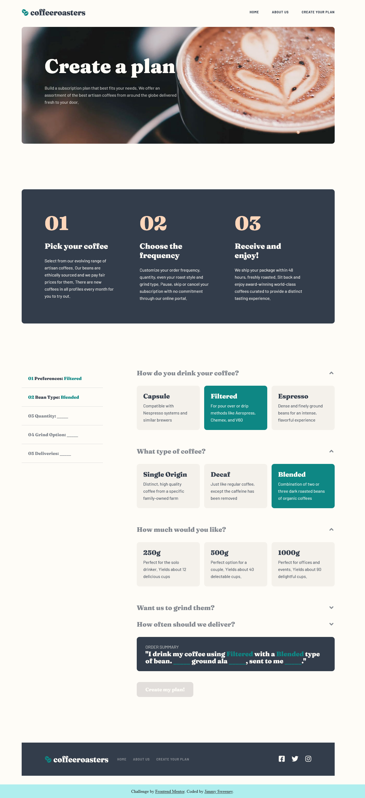

# Frontend Mentor - Coffeeroasters subscription site solution

This is a solution to the [Coffeeroasters subscription site challenge on Frontend Mentor](https://www.frontendmentor.io/challenges/coffeeroasters-subscription-site-5Fc26HVY6). Frontend Mentor challenges help you improve your coding skills by building realistic projects.

## Table of contents

- [Frontend Mentor - Coffeeroasters subscription site solution](#frontend-mentor---coffeeroasters-subscription-site-solution)
  - [Table of contents](#table-of-contents)
  - [Overview](#overview)
    - [The challenge](#the-challenge)
    - [Screenshot](#screenshot)
    - [Links](#links)
  - [My process](#my-process)
    - [Built with](#built-with)
    - [What I learned](#what-i-learned)
    - [Continued development](#continued-development)
    - [Useful resources](#useful-resources)
  - [Author](#author)

**Note: Delete this note and update the table of contents based on what sections you keep.**

## Overview

### The challenge

Users should be able to:

- View the optimal layout for each page depending on their device's screen size
- See hover states for all interactive elements throughout the site
- Make selections to create a coffee subscription and see an order summary modal of their choices

### Screenshot



### Links

- Solution URL: [](https://www.frontendmentor.io/solutions/coffeeroasters-subscription-site-with-react-and-styledcomponents-N_VePArqn)
- Live Site URL: [](https://jsweeney-coffeeroasters-subscription-site.netlify.app/)

## My process

### Built with

- Semantic HTML5 markup
- Flexbox
- Mobile-first workflow
- [React](https://reactjs.org/) - JS library
- [Styled Components](https://styled-components.com/) - For styles
- [Reach Accordian](https://reach.tech/accordion/) - for the order form

### What I learned

### Continued development

I had a few major challenges with completing this project. The first was committing to a style and component organization. I settled on housing components and their child components into the same folder. In that same folder I created a `styles.js` file that housed all of those components' styles. I'm decently happy with the organization but it still felt like a bit of a mess at times. I think I could have created more smaller styled-components to make my styles more readable. That'll be something to work on.

The second challenge was considering a way to maintain the state and props of all the components of the order form. I'm a little uncertain with how "readable" my code is. There are probably areas where I could have been passing props more consistently, for example.

I tried to mimic grabbing data from a content management system by putting content into their own files as objects. I realized that this was pretty much impossible when it came to creating the form, though. I ended up having to hard-cord some of the content into the components themselves.

Finally, I think I need to more fully understand `useEffect`. I ended up having to add this line `// eslint-disable-next-line react-hooks/exhaustive-deps` in order to remove a warning that prevented the site to be built on Netlify.

UPDATE: With the help of some discord buddies, I figured out my `useEffect` problem. The logic inside my `useEffect` hook should never have been in `useEffect` but rather on the event handler (`Fieldset`'s `handleChange`). I just needed to make sure I was accessing the new version of `userInput` when checking if the preference was "Capsule".

```js
useEffect(() => {
  if (userInput.preference === "Capsule") {
    setGrindOptionDisabled(true);
    let newAccordianIndices = accordianIndices.filter((num) => num !== 3);
    setAccordianIndicies(newAccordianIndices);
  } else {
    setGrindOptionDisabled(false);
  }
  // eslint-disable-next-line react-hooks/exhaustive-deps
}, [userInput.preference]);
```

I just want `useEffect` to be called when `userInput.preference` is changed. Without that commented line, React tells me to add `setGrindOptionDisabled` and `setAccordianIndicies` to the dependency array. But if I do that, `setAccordianIndicies` ends up getting rerendered infitely which is definitely what I don't want to happen. For now, I'm happy that this works, but I need to better understand what I'm missing when it comes to `useEffect`.

### Useful resources

-[react-modal](https://github.com/briancodex/react-modal-v1) I borrowered from this tutorial heavily for displaying the modal. The key is wrapping the modal with a Background styled-component. The Background component fills the entire screen. Other than that, it's only styling is a transparent black to give the illusion that the modal is popping up and everything else is gray-ed out. Then you attach a ref to the Background, if the Background is clicked, the ref matches the event target, and you set the display to false.

## Author

- Website - [Add your name here](https://jimmysweeney.page)
- Frontend Mentor - [@yourusername](https://www.frontendmentor.io/profile/sweenejp)
